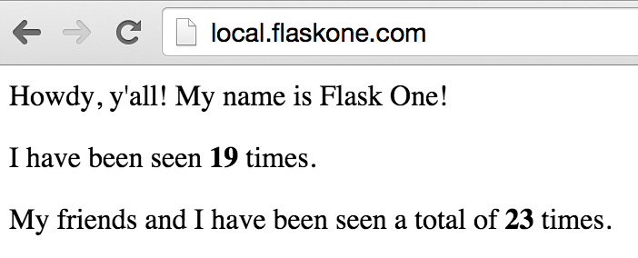

# Developing an App

Running applications with Dusty is only part of the story. To have an effective
development environment, we also need to be able to make changes to our running
code quickly and run tests against local changes to the code. Let's see how Dusty
helps us do these things.

## Using your Local Copy

By default, Dusty manages its own copy of any repositories used to run applications.
This is fine if you just want to run things, but to develop interactively you need
to tell Dusty to use the local copy of the repository into which you're making your
changes. Let's check out a copy of the `hello-world` Flask app.

```
> cd ~
> git clone https://github.com:gamechanger/dusty-flask-example.git
Cloning into 'dusty-flask-example'...
```

This repository contains the code for the Flask app in `app.py`. Once we've checked
out a copy, we can tell Dusty to use it by issuing a repo override command.

```
> dusty repos list
+--------------------------------------------------------+---------------------+-------------------------+
|                       Full Name                        |      Short Name     |      Local Override     |
+--------------------------------------------------------+---------------------+-------------------------+
| https://github.com/gamechanger/dusty-example-specs.git | dusty-example-specs |                         |
| https://github.com/gamechanger/dusty-flask-example.git | dusty-flask-example |                         |
|      https://github.com/gamechanger/watchdog.git       |       watchdog      |                         |
+--------------------------------------------------------+---------------------+-------------------------+
> dusty repos override dusty-flask-example ~/dusty-flask-example
Locally overriding repo github.com/gamechanger/dusty-flask-example to use source at ~/dusty-flask-example

> dusty repos list
+--------------------------------------------------------+---------------------+-------------------------+
|                       Full Name                        |      Short Name     |      Local Override     |
+--------------------------------------------------------+---------------------+-------------------------+
| https://github.com/gamechanger/dusty-example-specs.git | dusty-example-specs |                         |
| https://github.com/gamechanger/dusty-flask-example.git | dusty-flask-example |  ~/dusty-flask-example  |
|      https://github.com/gamechanger/watchdog.git       |       watchdog      |                         |
+--------------------------------------------------------+---------------------+-------------------------+
```

Once the override is in place, Dusty will take care of mounting our local copy inside any
future app containers that require it.

## Running your Changed Code

Let's make a change in `app.py` and see how we can get that to show up in our running application.
A simple copy change should do. Let's change "Hello world!" to "Howdy, y'all!".

```python
# Change this...
<p>Hello world! My name is {}!</p>
# To this!
<p>Howdy y'all! My name is {}!</p>
```

Save your changes, then go to `local.flaskone.com` to see the running app. You should see that
the app is still showing "Hello world!". This is because we haven't done anything to tell Dusty
to restart the app with our new code. To do this, we issue a `dusty restart` command.

```
> dusty restart flaskone
Restarting the following apps or services: flaskone
Syncing overridden repo github.com/gamechanger/dusty-flask-example to remote at /persist/repos/github.com/gamechanger/dusty-flask-example
Restarting dusty_flaskone_1
```

What just happened here? Dusty synced our local copy to the boot2docker VM, which made our changed
code available to use by our applications. It then restarted the `flaskone` application so that
it'd pick up the new code. Let's refresh `local.flaskone.com` now and see our changes.



That's all there is to it! Just remember to `dusty restart` whenever you want to update your
running applications with any new code. You can also sync over your changed code without
restarting the app by using `dusty sync`.

## Running Tests

Dusty specs can also define how tests are run for a given app. There is a mocked out
test case in the `flaskone` app. Let's run it now.

To see the test suites available for an app, use `dusty test`.

```
> dusty test flaskone
+------------+---------------------------------------+--------------+
| Test Suite |              Description              | Default Args |
+------------+---------------------------------------+--------------+
|    unit    | Run unit tests in their own container |              |
+------------+---------------------------------------+--------------+
```

Our `flaskone` app has a single test suite called `unit`. We can run this test in its
own isolated testing environment (spinning up its own containers both for the app code
and for any services it depends on) with a single command:

```
> dusty test flaskone unit
...
Creating testflaskone_flaskone_1...
..
----------------------------------------------------------------------
Ran 2 tests in 0.001s

OK
TESTS PASSED
```

Each time we run tests, Dusty will sync our overridden repo into the test container.
Let's prove this now. Go ahead and open `app_test.py` in the Flask repo. Let's break
the `test_upper` test by forgetting how math works.

```python
def test_upper(self):
    1/0
```

When we run `dusty test` again, our updated code gets mounted in the container and
we should see our test failure.

```
> dusty test flaskone unit
...
Creating testflaskone_flaskone_1...
.E
======================================================================
ERROR: test_upper (__main__.TestTrivialPythonStuff)
----------------------------------------------------------------------
Traceback (most recent call last):
File "app_test.py", line 5, in test_upper
1/0
ZeroDivisionError: integer division or modulo by zero

----------------------------------------------------------------------
Ran 2 tests in 0.000s

FAILED (errors=1)
TESTS FAILED
```

This is a very basic illustration of the testing functionality. Dusty also lets you
define multiple test suites, spin up temporary service containers to test against,
and pass arguments to your test commands. For more details, see the CLI and spec
definition parts of the documentation.
