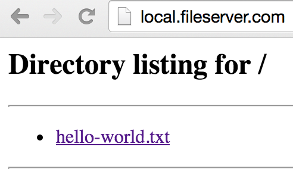

# Moving Files Around

Sometimes, you really want to be able to get files into or out of
your application containers. For example, you may want to import some
production data for testing. Dusty has you covered here with its
`dusty cp` command. Let's go over an example using this now.

The example specs repo comes with a simple fileserver application.
Let's activate its bundle and run it now.

```
> dusty bundles list
+-------------+--------------------------------------------------------+----------+
|     Name    |                      Description                       | Enabled? |
+-------------+--------------------------------------------------------+----------+
|  fileserver |      A simple fileserver to demonstrate dusty cp       |          |
| hello-world | Hello world! Two running copies of a simple Flask app. |          |
+-------------+--------------------------------------------------------+----------+

> dusty bundles activate fileserver
Activated bundles fileserver

> dusty up
...
Your local environment is now started!
```

We've just started a simple Python fileserver at `local.fileserver.com`. You should
be able to see it now in your browser. It starts with a single file, `hello-world.txt`.



If we check out the app spec `fileserver.yml`, we can see how this is running:

```
commands:
  always:
    - mkdir -p /fileserver
    - cd /fileserver
    - echo 'Hello world!' > hello-world.txt
    - python -m SimpleHTTPServer 80
```

We're serving files from inside the `/fileserver` directory in the container. Let's
use that knowledge to see how we can move files around.

## Copying Files with dusty cp

The `dusty cp` command lets us copy files from, to, and even between containers.
Just like any other CLI command, we can call it with `-h` to print out its help message.

```
> dusty cp -h
Copy files between your local filesystem and Dusty-managed containers.
This tool also supports copying files directly between two containers.

To specify a file or directory location, either give just a path to
indicate a location on your local filesystem, or prefix a path with
`<service>:` to indicate a location inside a running container.

Usage:
  cp <source> <destination>

Examples:
  To copy a file from your local filesystem to the container of an app called `website`:
    cp /tmp/my-local-file.txt website:/tmp/file-inside-website-container.txt

  To copy a file from that same `website` container back to your local filesystem:
    cp website:/tmp/file-inside-website-container.txt /tmp/my-local-file.txt

  To copy a file from the `website` container to a different container called `api`:
    cp website:/tmp/website-file.txt api:/different/location/api-file.txt
```

Let's take this for a spin now. Remember the `hello-world.txt` file that we saw in
our browser? Let's grab that out of the container now.

```
> cd ~
> dusty cp fileserver:/fileserver/hello-world.txt ~/hello-world.txt
> cat hello-world.txt
Hello world!
```

The first argument to `dusty cp` has two parts: the name of the app or service from
which we're copying files (here, `fileserver`), and the path within the container
that we want to copy. These are separated by `:`. The second argument doesn't have
a `:`, so it's assumed to be a local path.

That's how we copy *from* a container. To copy *to* a container, we just reverse the
order of our arguments. Let's make a new text file and upload it to our fileserver.

```
> cd ~
> echo "Howdy" > howdy.txt
> dusty cp ~/howdy.txt fileserver:/fileserver/howdy.txt
```

Our fileserver updates dynamically, so we can refresh `local.fileserver.com` and
immediately see our changes:


That's all there is to it! You can also copy files between containers, just specify
an app or service name for both destinations and Dusty will take care of the rest.
