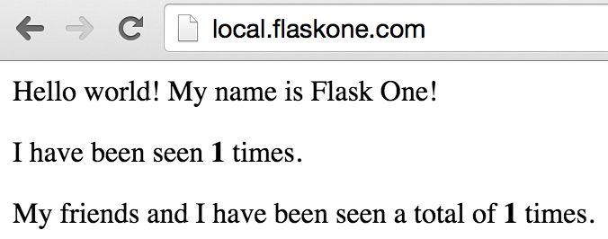

# Hello World!

Remember when we ran that `dusty bundles list` command? There was a bundle called `hello-world`.
That seems like something we should probably run first. The `hello-world` bundle will run two
small Flask apps. Each Flask app will be available from a browser on your Mac, and they'll
each talk to a shared MongoDB instance.

The first step to running any bundle is to activate it:

```
> dusty bundles activate hello-world
Activated bundles hello-world
> dusty bundles list
+------------------+-------------------------------------------------------------------+------------+
|       Name       |                            Description                            | Activated? |
+------------------+-------------------------------------------------------------------+------------+
|    fileserver    |            A simple fileserver to demonstrate dusty cp            |            |
|   hello-world    |       Hello world! Two running copies of a simple Flask app.      |     X      |
| ipython-notebook |  Runs an iPython Notebook at local.ipython.com. Password is dusty |            |
|  mongo-cluster   | Run a Mongo replica set by using container network daisy-chaining |            |
|     watchdog     |  Launches an example watchdog app, demonstrating libs and scripts |            |
+------------------+-------------------------------------------------------------------+------------+
```

Once the bundle is activated, you can use `dusty status` to see what apps, services, and
libs will be run with your current configuration:

```
> dusty status
+-----------------+---------+----------------------+
|       Name      |   Type  | Has Active Container |
+-----------------+---------+----------------------+
|     flaskone    |   app   |                      |
|     flasktwo    |   app   |                      |
| persistentMongo | service |                      |
+-----------------+---------+----------------------+
```

So there are the two Flask apps we talked about, plus the Mongo service. Great.

## Dusty Up

Time to run everything! Once you've activated the bundles you want, just issue
a single `dusty up` command and Dusty will take care of the rest.

```
> dusty up
A bunch of lines go here...
...
...
Your local environment is now started!
```

If we check the status again, we should see everything running. We can also
see the containers directly using `docker ps`. Keep in mind that everything
you can normally do with Docker will still work when you're using Dusty!

```
> dusty status
+-----------------+---------+----------------------+
|       Name      |   Type  | Has Active Container |
+-----------------+---------+----------------------+
|     flaskone    |   app   |          X           |
|     flasktwo    |   app   |          X           |
| persistentMongo | service |          X           |
+-----------------+---------+----------------------+
```

And now, for the final test, can we reach these apps in our browser? They make
themselves available at `local.flaskone.com` and `local.flasktwo.com`. Go ahead
and navigate to one. You should see this:



Try hitting both of the URLs. The combination of the individual and shared counter
shows that we are indeed running two apps and they are coordinating with each other
over the shared Mongo instance.

We've covered the basics of running bundles with Dusty. In the next section, we'll
go over how to actively develop our applications, see our changes, and run tests.
